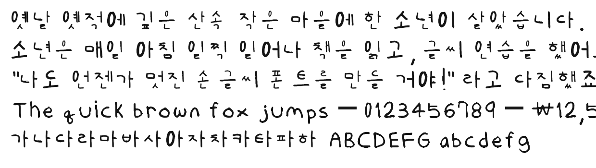
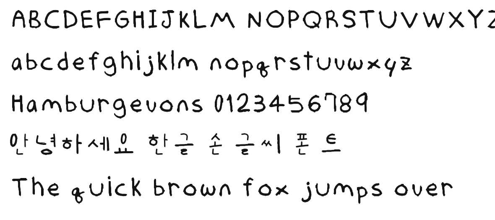

# Lightheaded — 손글씨 폰트

A light, even-weight **handwriting font built from hand-drawn templates** —
Korean (한글), Latin, digits and symbols — generated automatically from photos
of filled-in jamo/ASCII template sheets.

| Download | Coverage | Size |
|---|---|---|
| **[`Lightheaded-Regular.ttf`](Lightheaded-Regular.ttf)** | Korean + Latin + symbols | ≈0.58 MB |
| **[`Lightheaded-Latin-Regular.ttf`](Lightheaded-Latin-Regular.ttf)** | Latin + symbols only (no Korean) | ≈0.04 MB |



## What's in the full font

| Coverage | Count | Notes |
|---|---|---|
| Hangul syllables | **11,172** | every modern syllable U+AC00–U+D7A3, composed from your jamo |
| Compatibility jamo | 51 | standalone ㄱ–ㅎ, ㅏ–ㅣ (U+3131–U+3163) |
| Latin | A–Z, a–z | consistent cap-height / x-height, even spacing |
| Digits & symbols | 0–9 + full ASCII | `! @ # $ % ^ & * ( ) … ~` (`$ ^ \` |` synthesised to match) |
| Typography | — | en/em dash, ellipsis, middle dot, curly quotes, ₩ won |
| **Total glyphs** | **11,389** | UPM 1000, `fsType` 0 (embeddable) |

Only **67 jamo + 88 ASCII glyphs were hand-drawn**; the 11,172 syllables are
assembled from the jamo by an automatic composition engine (6 layout types,
position-aware finals), so Korean is fully typeable.

The **Latin version** has the same 99 outlines but no Hangul — use it when you
only need English/symbols, or want a tiny file.

## Consistency & weight

The font is tuned for an even, *lightheaded* look:

- **Stroke weight** normalised to a consistent ~85 em across Korean and Latin
  (the heavy marker strokes were thinned to match).
- **Letter sizes** pulled toward consistent cap-height / x-height per category.
- **Spacing** uses uniform side bearings; Korean syllables are fixed-width.



## How it was made

1. **Extract** the pen strokes from each template cell (drop printed reference,
   grid lines, neighbour-cell bleed).
2. **Normalise** stroke weight & letter size.
3. **Vectorise** with `potrace`.
4. **Compose** all 11,172 syllables from the jamo as TrueType composites.
5. **Assemble** with `fontTools`; clean winding with `skia-pathops`.

Full reproducible source in [`build/`](build/).

## Using it

Double-click a `.ttf` to install, or on the web:

```css
@font-face{ font-family:"Lightheaded";
            src:url("Lightheaded-Regular.ttf"); }
body{ font-family:"Lightheaded", sans-serif; }
```

> The Latin-only file is family **“Lightheaded Latin”** so it can be installed
> alongside the full font without clashing.
