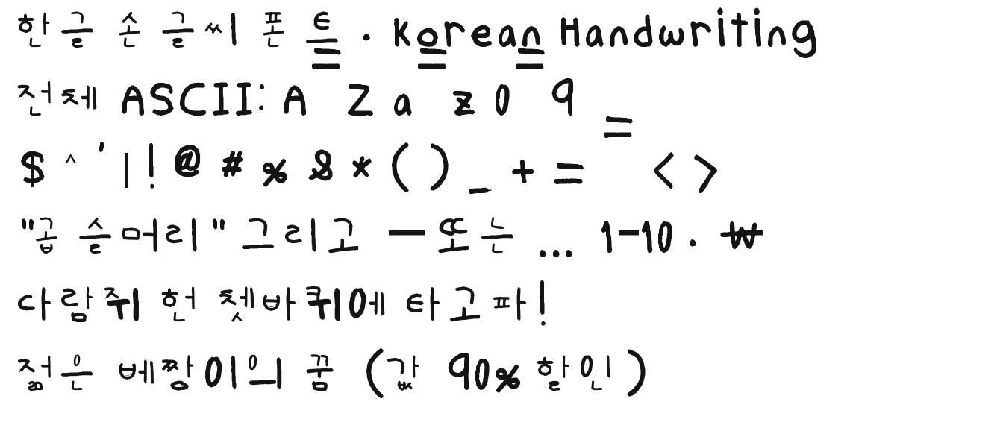
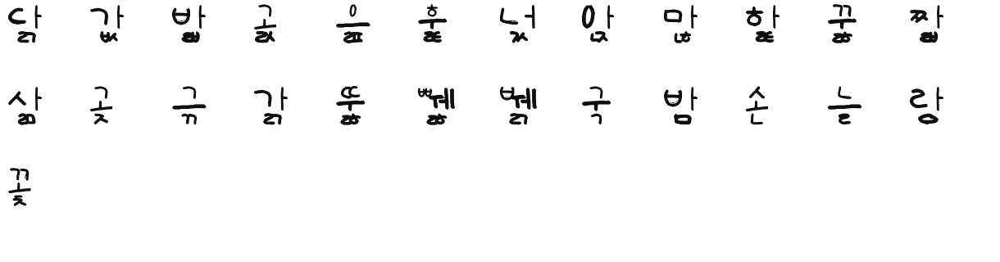

# Songil Handwriting — 손글씨 폰트

A complete **handwriting font built from hand-drawn templates** — Korean (한글),
Latin, digits and symbols — generated automatically from photos of filled-in
jamo/ASCII template sheets.

**→ Download: [`SongilHandwriting-Regular.ttf`](SongilHandwriting-Regular.ttf)** (≈0.58 MB, TrueType)


## What's in the font

| Coverage | Count | Notes |
|---|---|---|
| Hangul syllables | **11,172** | every modern syllable U+AC00–U+D7A3, composed from your jamo |
| Compatibility jamo | 51 | standalone ㄱ–ㅎ, ㅏ–ㅣ (U+3131–U+3163) |
| Latin | A–Z, a–z | proper baseline, x-height, ascenders/descenders |
| Digits & symbols | 0–9 + full ASCII | `! @ # $ % ^ & * ( ) … ~` (`$ ^ \` |` synthesised to match) |
| Typography | — | en/em dash, ellipsis, middle dot, curly quotes, ₩ won |
| **Total glyphs** | **11,389** | UPM 1000, `fsType` 0 (embeddable) |

Only **67 jamo + 88 ASCII glyphs were hand-drawn**; the 11,172 syllables are
assembled from the jamo by an automatic composition engine (6 layout types,
position-aware finals), so Korean is fully typeable.

## How it was made

The pipeline turns the 10 template photos into a font, end to end:

1. **Extract** – locate each template cell, isolate the pen strokes from the
   printed reference/grid (drop neighbour-cell bleed, guide lines, box borders).
2. **Vectorise** – `potrace` each cleaned glyph into smooth Bézier outlines.
3. **Latin/symbols** – map to Unicode with a calibrated baseline & side bearings.
4. **Hangul** – place cho/jung/jong into syllable zones; emit all 11,172
   syllables as TrueType **composite** glyphs (keeps the file ~0.5 MB).
5. **Assemble** – build `glyf/cmap/hmtx/OS2/...` with `fontTools`, fix winding
   and stroke crossings with `skia-pathops`.

See [`build/`](build/) for the full, reproducible source.

## Using it

Double-click the `.ttf` to install (macOS Font Book / Windows / Linux), or load
it on the web:

```css
@font-face { font-family:"Songil Handwriting";
             src:url("SongilHandwriting-Regular.ttf"); }
body { font-family:"Songil Handwriting", sans-serif; }
```

> **Name** — the family is currently *“Songil Handwriting”* (손길, “a hand’s
> touch”). It's a one-line change in `build/build_font.py` (`FAMILY=...`) if
> you'd like to rename it.

## Samples

| | |
|---|---|
|  |  |
